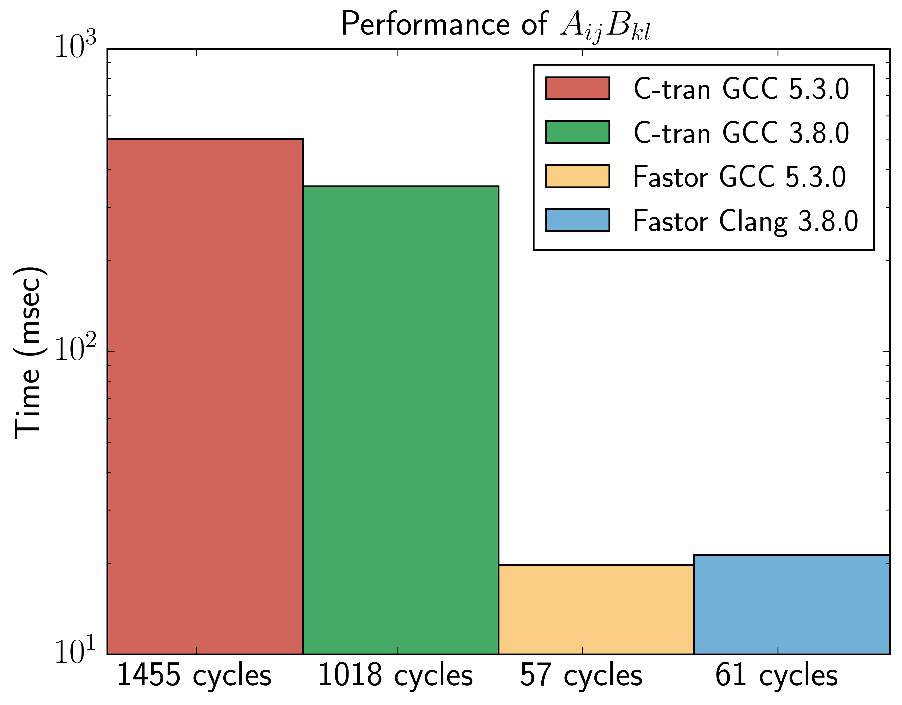
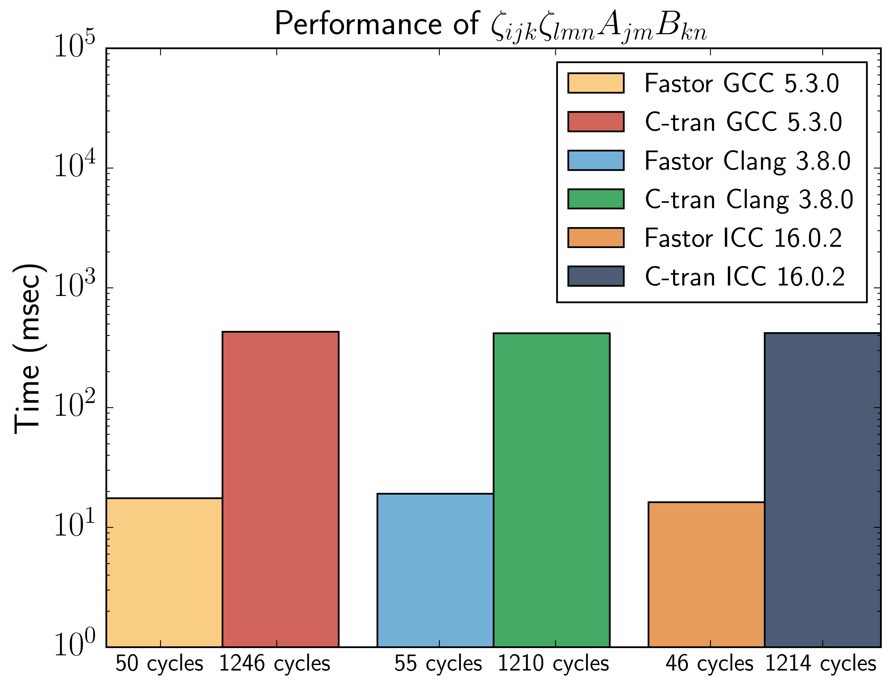
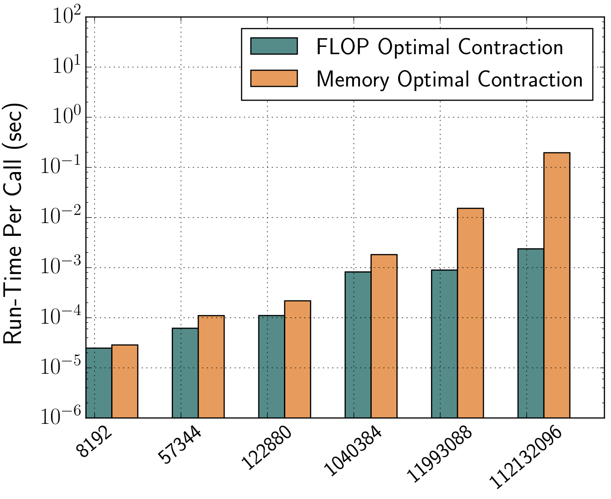
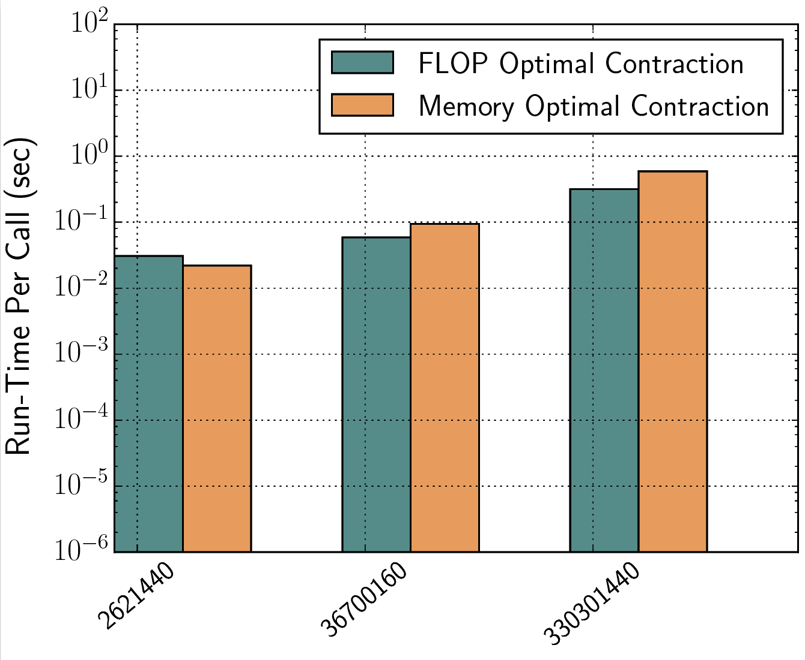

# Fastor
**Fastor** is a **FA**st **S**IMD op**T**imised tens**OR** algebra framework, with emphasis on tensor contraction algorithms typically arising in the mechanics of nonlinear solids, fluids and coupled continua. There are two paradigms that Fastor exploits:

- **Operation minimisation/complexity reducing algorithms** via statically dispatched (zero-overhead) bespoke kernels for a set of tensor products using either a priori knowledge of tensors (through topological studies) or smart expression templates (that perform mathematical transformation or *compile time* graph optimisation) or both
- **Data parallelism/stream computing** by utilising explicit SIMD (SSE/AVX) intrinsics

### High-level API
Fastor provides a high level interface for tensor algebra. As a first example consider the following
~~~c++
Tensor<double> scalar; // A scalar
Tensor<double,6> vector6; //  A vector
Tensor<double,4,5> matrix; // A second order tensor
Tensor<double,3,3,3> tensor_3; // A third order tensor with dimension 3x3x3 
tensor_3.arange(0); // fill tensor with sequentially ascending numbers
print(tensor_3); // print out the tensor
tensor_3(0,2,1); // index a tensor
tensor_3.rank(); // get rank of tensor, 3 in this case
Tensor<float,2,2,2,2,1,2,2,4,3,2,3,3,6> tensor_13; // A 13th order tensor 
~~~
will output the following
~~~bash
[0,:,:]
⎡      0,       1,       2 ⎤
⎢      3,       4,       5 ⎥
⎣      6,       7,       8 ⎦
[1,:,:]
⎡      9,      10,      11 ⎤
⎢     12,      13,      14 ⎥
⎣     15,      16,      17 ⎦
[2,:,:]
⎡     18,      19,      20 ⎤
⎢     21,      22,      23 ⎥
⎣     24,      25,      26 ⎦
~~~
Einstein summation as well as summing over multiple (i.e. more than two) indices are supported 
~~~c++
Tensor<double,3,4,4> A; Tensor<double,4,5,6,7> B;
// fill A and B

auto C = einsum<Index<I,J,K>,Index<J,L,M,N>>(A,B);
auto D = contraction<Index<I,I,J>,Index<I,K,P,Q>>(A,B);  // index I appearing 3 times
~~~

### No heap allocation
Fastor is essentially designed for small mutlidimensional tensors, that can appear in computing stresses, work conjugates, Hessian etc, during numerical integration in a finite element framework. As can be seen from the above examples, Fastor is based on fixed size static arrays (entirely stack allocation). The dimensions of the tensors must be known at compile time, which is typically the case for the use-cases it is designed for. However one of the strongest features of Fastor is in its in-built template meta-programming engine, in that, it can automatically determine at *compile time*, the dimensions of the tensors resulting from a complex operation yet to be performed, hence it can always allocate exactly the right amount of stack memory required. This is in contrast to static arrays in `C` or `Fortran` where one has to allocate a huge block of memory before hand to avoid stack overflow.   

### Static disptaching for absolute branchless code
This is a strong statement to make, but Fastor strives to generate optimised SIMD code by utilising the static nature of tensors and the `SFINAE` (Substitution Failure Is Not an Error) feature of `C++11` to statically dispatch calls to bespoke kernels, which completely avoids the need for runtime branching. For example the double contraction of two second order double precision tensors  `A` and `B`, `A_ij*B_ij` with dimensions `2x2`, is statically dispatched to 
~~~c++
return _mm256_sum_pd(_mm256_mul_pd(_mm256_load_pd(A._data),_mm256_load_pd(B._data)));
~~~
(Notice that the double contraction of two second order tensors of `2x2` requires `4 multiplication + 3 addition` which using SIMD lanes can be reduced to `1 multiplication + 1 addition`. Also `_mm256_sum_pd` is Fastor's in-built extension to SIMD intrinsics.) while for `3x3` double precision second order tensors the call is dispatched to 
~~~c++
__m256d r1 = _mm256_mul_pd(_mm256_load_pd(A._data),_mm256_load_pd(B._data));
__m256d r2 = _mm256_mul_pd(_mm256_load_pd(A._data+4),_mm256_load_pd(B._data+4));
__m128d r3 = _mm_mul_sd(_mm_load_sd(A._data+8),_mm_load_sd(B._data+8));
__m128d summ = _mm_add_pd(_add_pd(r3),_add_pd(_mm256_add_pd(r1,r2)));
return _mm_cvtsd_f64(summ);
~~~
without the need for a branch or a potential `jmp` instruction in assembly (again note that `9 multiplication + 8 addition` is reduced to `3 multiplication + 3 addition`). The main motivation behind customising/optimising these operations for such small tensors is that they are typically needed in the critical hotspots of finite element implementations (i.e. they almost always happen to appear at every quadrature point).  

### Performance benchmark
Consider the dyadic product `A_ik*B_jl`, that can be computed in Fastor like 
~~~c++
Tensor<double,3,3> A,B;
A.random(); B.random();
using Fastor::Voigt;
Tensor<double,6,6> C = einsum<Index<0,2>,Index<1,3>,Voigt>(A,B);
// or alternatively
enum {I,J,K,L};
Tensor<double,6,6> D = einsum<Index<I,K>,Index<J,L>,Voigt>(A,B);
~~~

As you notice, all indices are resolved and the Voigt transformation is performed at compile time, keeping only the cost of computation at runtime. Equivalent implementation of this in C/Fortran requires either low-level for loop style programming that has an O(n^4) computational complexity and non-contiguous memory access, or if a function like einsum is desired the indices will need to be passed requiring potentially extra register allocation. Here is performance benchmark between Ctran (C/Fortran) for loop code and the equivalent Fastor implementation for the above example, run over a million times (both compiled using `-O3 -mavx`, on `Intel(R) Xeon(R) CPU E5-2650 v2 @2.60GHz` running `Ubuntu 14.04`):       

  

Notice that by compiling with the same flags, it is meant that the compiler is permitted to auto-vectorise the C/tran code as well. The real performance of Fastor comes from the fact, that when a Voigt transformation is requested, Fastor does not compute the elements which are not needed.
### The tensor cross product and its associated algebra
If not the main, one of the main motivations behind developing Fastor has been the recently introduced tensor cross product by [Bonet et. al.](http://dx.doi.org/10.1016/j.ijsolstr.2015.12.030) and its associated algebra, in the context of nonlinear solid mechanics which can significantly reduce the amount algebra involved in consistent linearisation of functionals which are forbiddingly complex to derive using the classical approach. The tensor cross product of two second order tensors is defined as `C_iI = e_ijk*e_IJK*A_jJ*b_kK` where `e` is the third order permutation tensor. As can be seen this product is O(n^6) in computational complexity (furthermore a cross product is essentially defined in 3-dimensional space i.e. perfectly suitable for stack allocation). Using Fastor the equivalent code is only 81 SSE intrinsics
~~~c++
// A and B are second order tensors
using Fastor::LeviCivita_pd;
Tensor<double,3,3> E = einsum<Index<i,j,k>,Index<I,J,K>,Index<j,J>,Index<k,K>>
                       (LeviCivita_pd,LeviCivita_pd,A,B);
// or simply
Tensor<double,3,3> F = cross(A,B);
~~~
Here is performance benchmark between Ctran (C/Fortran) code and the equivalent Fastor implementation for the above example, run over a million times (both compiled using `-O3 -mavx`, on `Intel(R) Xeon(R) CPU E5-2650 v2 @2.60GHz` running `Ubuntu 14.04`):

  

Notice the almost two orders of magnitude performance gain using Fastor. Again the real performance gain comes from the fact that Fastor eliminates zeros from the computation.

### Smart expression templates
A must have feature of every numerical linear algebra and even more so tensor contraction frameworks is lazy evaluation of arbitrary chained operations. Consider the following expression

~~~c++
Tensor<float,16,16,16,16> tn1 ,tn2, tn3, tn4;
tn1.random(); tn2.random(); tn3.random();
tn4 = 2*tn1+sqrt(tn2-tn3);
~~~
The above code is transparently converted to a single `AVX` loop
~~~c++
for (size_t i=0; i<tn4.Size; i+=tn4.Stride)
    _mm256_store_ps(tn4._data+i,_mm256_set1_ps(static_cast<float>(2))*_mm256_load_ps(tn1._data+i)+
    _mm256_sqrt_ps(_mm256_sub_ps(_mm256_load_ps(tn2._data+i),_mm256_load_ps(tn3._data+i)));
~~~
avoiding any need for temporary memory allocation. Importantly, Fastor goes deeper into the realm of *smart* expression templates to find optimal contraction indices of complex tensor networks, for instance an expression like `trace(matmul(transpose(A),B))` which is `O(n^3)` in computational complexity is determined to be inefficient and Fastor statically dispatches the call to an equivalent but much more efficient routine, in this case `A_ijB_ij` or `doublecontract(A,B)` which is `O(n^2)`. Further examples include
~~~c++
// the l in-front of the names stands for 'lazy'
ldeterminant(linverse(A)); // transformed to 1/ldeterminant(A), O(n^3) reduction in computation
ltranspose(lcofactor(A));  // transformed to ladjoint(A), O(n^2) reduction in memory access
ltranspose(ladjoint(A));   // transformed to lcofactor(A), O(n^2) reduction in memory access
lmatmul(lmatmul(A,B),b);   // transformed to lmatmul(A,lmatmul(B,b)), O(n) reduction in computation
// and many more
~~~
Note that there are situations that the user may write a complex chain of operations in the most verbose way, perhaps for readibility purposes, but Fastor delays the evaluation of the expression and checks if an equivalent but efficient expression can be computed. The computed expression always binds back to the base tensor, overhead free without a runtime (virtual table/pointer) penalty.  

For higher rank tensor networks comprising of many tensors, a full generalisation of the above mathematical transformation can be performed through a graph search optimisation. This typically involves finding the most optimal pattern of tensor contraction by studying the indices of contraction wherein tensor pairs are multiplied, summed over and factorised out in all possible combinations in order to come up with a cost model. Once again, knowing the dimensions of the tensor and the contraction pattern, Fastor performs this operation minimisation step at *compile time* and further checks the SIMD vectorisability of the tensor contraction loop nest (i.e. full/partial/reducible vectorisation). In nutshell, it not only minimises the the number of floating point operations but also generates the most optimum vectorisable loop nest for computing those FLOPs. The following figures show the run time benefit of operation minimisation (FLOP optimal) over a single expression evaluation (Memory optimal) approach in contracting a three-tensor-network fitting in `L1`, `L2` and `L3` caches, respectively 

  
  
  

The X-axis shows the number FLOPS saved/reduced over single expression evaluation scheme. Certainly, the bigger the size of tensors the more reduction in FLOPs is necessary to over to compensate for the temporaries created during by-pair evalution. 

### Boolean tensor algebra
A set of boolean tensor routines are available in Fastor. Note that, whenever possible most of these operations are performed at compile time 
~~~c++
is_uniform();   // does the tensor span equally in all spatial dimensions, generalisation of square matrices
is_orthogonal();
does_belong_to_sl3(); // does the tensor belong to special linear 3D group
does_belong_to_so3(); // does the tensor belong to special orthogonal 3D group
is_symmetric(int axis_1, int axis_2); // is the tensor symmetric in the axis_1 x axis_2 plane
is_equal(B); // equality check with another tensor 
is_identity(); 
~~~

### Basic SIMD optimised linear algebra routines for small tensors
All basic numerical linear algebra subroutines for small tensors are completely SIMD optimised as Fastor is all about small stack-allocated (on cache tensors), where the overhead of calling vendor/optimised `BLAS` is typically not worth it 
~~~c++
Tensor<double,3,3> A,B; 
// fill A and B                 
auto ab = matmul(A,B);          // matrix matrix multiplication of A*B
auto a_norm = norm(A);          // Frobenious norm of A
auto b_det = determinant(B);    // determinant of B
auto a_inv = inverse(A);        // inverse of A
auto b_cof = cofactor(B);       // cofactor of B
~~~

### Template meta-programming for powerful tensor contraction/permutation
Fastor utilises a bunch of meta-functions to perform most operations at compile time, consider the following examples
~~~c++
Tensor<double,3,4,5> A;
Tensor<double,5,3,4> B;
Tensor<double,3,3,3> C;
auto D = permutation<Index<2,0,1>>(A); // type of D is deduced at compile time as Tensor<double,5,3,4>
auto E = einsum<Index<I,J,K>,Index<L,M,N>>(D,B); // type of E is deduced at compile time as Tensor<double,5,3,4,5,3,4>
auto F = einsum<Index<I,I,I>>(C); // type of F is deduced at compile time as scalar i.e. Tensor<double>
auto F2 = reduction(C); // same as above, returned value is a scalar Tensor<double>
auto E2 = einsum<Index<I,J,K>,Index<I,J,K>>(D,B); // type of E is deduced at compile time as Tensor<double>
Tensor<float,2,2> G,H;
einsum<Index<I,I>>(H); // trace of H
einsum<Index<I,J>,Index<I,J>>(G,H); // double contraction of G and H
~~~
As you can observe with combination of `permutation`, `contraction`, `reduction` and `einsum` (which itself is a glorified wrapper over the first three) any type of tensor contraction, and permutation that you can percieve of, is possible, and using meta-programming the right amount of stack memory to be allocated is deduced at compile time.

### A minimal framework
Fastor is extremely light weight, it is a *header-only* library, requires no build or compilation process and has no external dependencies. It is written in pure C++11 from the foundation.  

### Tested Compilers
Fastor has been tested against the following compilers (on Ubuntu 14.04 and Ubuntu 16.04)
- GCC 4.8, GCC 4.9, GCC 5.1, GCC 5.2, GCC 5.3, GCC 5.4, GCC 6.2
- Clang 3.6, Clang 3.7, Clang 3.8, Clang 3.9
- Intel 16.0.1, Intel 16.0.2, Intel 16.0.3, Intel 17.0.1

### Similar Projects
Similar projects exist in particular
- [FTensor](http://www.wlandry.net/Projects/FTensor): Dense tensor algebra framework for up to rank 4 tensors
- [LTensor](https://code.google.com/archive/p/ltensor/): Dense tensor algebra framework for up to rank 4 tensors
- [libtensor](https://github.com/juanjosegarciaripoll/tensor): Dense tensor algebra framework for up to rank 6 tensors
- [Eigen's unsupported tensor algebra package](http://eigen.tuxfamily.org/index.php?title=Tensor_support): Arbitrary rank dense tensor algebra module
- [Blitz++'s tensor module](http://blitz.sourceforge.net/): Dense linear algebra framework for up to rank 11 tensors 
- [TiledArray](https://github.com/ValeevGroup/tiledarray): Massively parallel arbitrary rank block sparse tensor algebra framework based on Eigen
- [Cyclops Tensor Framework](https://github.com/solomonik/ctf): Distributed memory arbitrary rank sparse tensor algebra framework

It should be noted, that compared to the above projects Fastor is *minimal* in terms of function overloads as well as design and does not try to be a full-fledged tensor algebra framework, like Eigen. It is designed with specific needs in mind. Some noteworthy differences are

- Most of Fastor's routines do not fall back to scalar code on non-SIMD architectures. That has just not been the goal of Fastor. In particular you need to have an AVX enabled micro-architecture for it to run, i.e. starting from Intel Sandy-Bridge or AMD Bulldozer generation onwards. Extension to support more vector enabled archetictures such as AVX-512, MIC and GPUs is planned and should be in fact straight-forward to plug them in, by using the [Vc](https://github.com/VcDevel/Vc) library. Fastor's underlying vector type APIs are purposely kept very close to `Vc`, so that in eventual case of porting, a change of namespace would suffice.  
- Fastor is for small tensors and stack allocated and the limit to the dimensions of the tensor is dictated by the compilers template instantiation depth which is by default 500 in `gcc` at which point you would certainly exceed stack-allocation limit anyway. Some of the above libraries are limited to a few dimensional tensors. 
- Most of the points mentioned above, like resolving indices at compile time, Voigt transformation, the einsum feature is specific to and niceties of Fastor. Some of these design principles certainly make Fastor less flexible compared to the above mentioned projects.
- While stable, Fastor is in its infancy, whereas most of the aforementioned projects have reached a certain level maturity. Unless you find some features of Fastor appealing and work in the areas that we do, there is no reason why you shouldn't be using one of the above projects. In particular, Eigen is a really powerful alternative. 